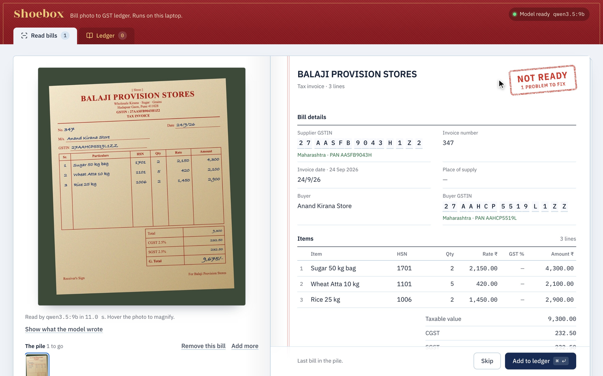

# Shoebox

Turn a phone photo of a GST bill into a checked ledger entry, on your own laptop.

No account. No API key. Bills never leave the machine.



## The problem

Most small shops in India keep their supplier bills in a pile until the accountant
asks for them. Typing them in is slow, and the bills themselves carry mistakes:
a GSTIN copied wrong, CGST that doesn't match SGST, a handwritten total with two
digits swapped, IGST charged on a purchase inside one state.

Each of those can cost input tax credit, and nobody looks closely until the CA
does. By then the supplier has moved on.

## How it works

1. **A local vision model copies the bill.** `qwen3.5:9b` running in Ollama fills
   in the fields as it reads, and you watch them appear. It is told to copy, never
   to calculate or correct. If the bill's own math is wrong, it copies it wrong.
2. **Plain code checks every field.** The model never decides whether a bill is
   right. TypeScript does, with the same answer every time.
3. **You review and fix.** A wrong field gets a red-pencil underline and the
   numbers behind the verdict. When exactly one look-alike swap (0/O, 1/I, 8/B)
   makes a GSTIN valid, the fix is one tap.
4. **Add it to the ledger, then send your CA a CSV.** The purchase register has one
   row per GST rate on each invoice, with the tax split between the rates.

## What it checks

| Check | The rule |
| --- | --- |
| GSTIN is real | Pattern, state code, and the 15th character: a Luhn mod-36 checksum, so any single misread character is caught |
| Every line adds up | Quantity × rate = amount, with a flat or percent discount |
| Tax matches the rates | Each line's GST rate applied to its amount adds up to the tax charged |
| CGST equals SGST | They are always equal inside one state |
| Right tax type | Supplier's state vs place of supply: CGST + SGST inside a state, IGST across states |
| Grand total adds up | Taxable value + GST + cess + round-off |
| Details make sense | A real date that isn't in the future, an invoice number of at most 16 characters (GST Rule 46), real GST rates, 4/6/8-digit HSN codes |
| No bill twice | The same supplier GSTIN and invoice number already in the ledger |

## How well it reads

`npx tsx scripts/eval.mts` reads the four sample bills in `public/samples` and
compares every field with what is printed (`samples/truth`). On an M5 Pro with
24 GB:

```
billbook-handwritten    38/38 fields   14.2 s  verdict fix    (right)
interstate-igst         46/46 fields   17.5 s  verdict ready  (right)
thermal-receipt         42/46 fields   15.1 s  verdict ready  (right)
wholesale-invoice       62/62 fields   22.7 s  verdict ready  (right)

188/192 fields read exactly (97.9%), 4/4 verdicts right, 17.4 s per bill on average
```

The four misses are per-line GST rates on the till receipt. The model filled in
18% from the receipt's single "CGST @9% / SGST @9%" line, which is correct but
isn't printed on each line. On the handwritten bill book it copied the wrong total
(₹9,675 where the lines come to ₹9,765) exactly as written, and the grand-total
check caught it.

These samples are generated, so treat the numbers as a floor for how the pieces
fit together, not a promise about your bills. Real photos are blurrier and
folded, and that is exactly what the checks are for.

## Run it

```bash
ollama pull qwen3.5:9b
npm install
npm run dev            # http://localhost:4631
```

Settings, all optional:

| Variable | Default | What it does |
| --- | --- | --- |
| `SHOEBOX_MODEL` | `qwen3.5:9b` | Any Ollama model that can read images |
| `OLLAMA_URL` | `http://127.0.0.1:11434` | Where Ollama is listening |
| `SHOEBOX_DATA` | `./data` | Where the ledger and bill photos are saved |

```bash
npm test                            # unit tests for every check, no model needed
npx tsx scripts/eval.mts            # score the model on the sample bills
npx tsx scripts/make-samples.mts    # rebuild the sample photos (needs Chrome and ImageMagick)
```

## Limits worth knowing

- Built for purchase tax invoices, the bills that carry input tax credit. Retail
  receipts with tax-inclusive prices read fine, but their line amounts are not
  taxable values, so the tax check may complain.
- A misread that stays consistent passes. If the model reads an item name wrong,
  no arithmetic will notice. Hover the photo to magnify it and glance at anything
  you care about.
- The rate check knows which GST rates exist (including the pre-September-2025
  slabs), not which rate an HSN code should carry.
- The export is CSV. There is no Tally XML yet.
- The sample businesses and GSTINs are made up. The GSTINs have valid check
  characters, and they belong to no one we know of.

Shoebox is a bookkeeping aid, not tax advice. Your accountant still signs the return.

## Layout

```
lib/          the logic, no framework: gstin, checks, dates, ledger, extract, partial-json, store
app/          Next.js pages and the API routes (extract streams, ledger, CSV)
components/   the UI: cover, photo page, ledger sheet, ledger view
scripts/      sample generator, model probe and eval
samples/      the truth for each sample bill
```

## License

MIT

---

### 🤝 Work with me

I'm an **AI Consultant · Forward Deployed Engineer**. I embed with teams and ship AI to production: agents, MCP integrations, and LLM features, with evals proving they work.

**→ [rohitraj.tech/hire](https://rohitraj.tech/hire)**
